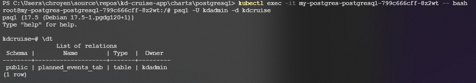
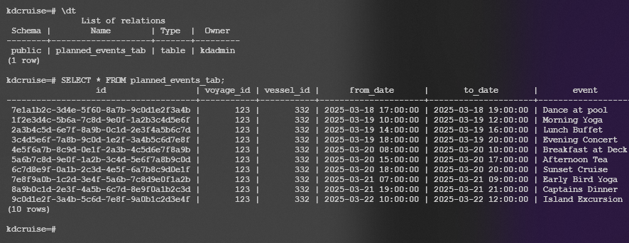

#KD Cruise Ship App

##Description
KD Cruise Ship App is a proof-of-concept web application designed for managing planned events and live ship positions for luxury cruise ships. The project includes:
-	A PostgreSQL database for storing planned events.
-	Kubernetes-based deployment using Helm charts.
-	GitOps automation with ArgoCD.
-	Docker Compose setup for local development.

This POC is designed to test the feasibility of the application on one cruise ship before scaling to the entire fleet.


##Features 

- **Planned Events Management**: Store and retrieve planned events for voyages.
- **PostgreSQL Database**: Robust database for event storage.
- **Kubernetes Deployment**: Helm charts for managing Kubernetes resources.
- **GitOps Automation**: ArgoCD for continuous delivery and synchronization.
- **Adminer Integration**: Web-based database management tool for PostgreSQL.


##Project Structure 
````
├── .github/workflows/ # CI/CD pipeline (GitHub Actions)
├── charts/ # Helm charts for Kubernetes management
│   └── postgresql/
│       ├── templates/ # Helm templates for PostgreSQL deployment
│       │   ├── deployment.yaml # Deployment manifest
│       │   ├── service.yaml # Service manifest
│       │   ├── configmap.yaml # ConfigMap for database configuration
│       │   └── _helpers.tpl # Helper functions for Helm templates
│       ├── values.yaml # Helm values for PostgreSQL
│       └── Chart.yaml # Helm chart metadata
├── database/ # DB init and schema
│   └── init.sql # PostgreSQL initialization script
├── infrastructure/ # ArgoCD manifests for GitOps
│   └── argocd/
│       └── kd-postgres-application.yaml # ArgoCD application manifest
├── docker/ # Docker Compose files
│   └── docker-compose.yml
├── src/ # Application source code
│   ├── KD.Cruise.PlannedEventsApi/ # ASP.NET Core API
│   └── KD.Cruise.BlazorApp/ # Frontend - Blazor WebAssembly
├── tests/ # Unit/integration tests
│   └── KD.Cruise.Tests/
└── README.md 
````

# Setup Instructions

### Prerequisites

Before you begin, ensure you have the following tools installed and set up on your local machine:

- **Git**: For cloning the repository.
- **Kubernetes**: Make sure you have a working Kubernetes cluster (e.g., Minikube, GKE, EKS, AKS, etc.).
- **Helm**: Helm should be installed to manage Kubernetes applications.
- **kubectl**: The Kubernetes command-line tool for interacting with your cluster.
- **psql**: A PostgreSQL client to interact with the database (should also be available via `kubectl exec`).

### Clone the Repository

To get started, clone the repository and navigate into the project directory:

```bash
git clone https://github.com/oyechr/kd-cruise.git
cd kd-cruise
```


# PostgreSQL Setup with Helm and Kubernetes

## Setup PostgreSQL with Helm:

1. Navigate to the PostgreSQL chart directory:
    ```bash
    cd 'C:\Users\{username}\source\repos\kd-cruise-app\charts\postgresql'
    ```

2. Install PostgreSQL using Helm:
    ```bash
    helm install my-postgres .
    ```

3. To uninstall PostgreSQL:
    ```bash
    helm uninstall my-postgres
    ```

4. Check the status of the pods:
    ```bash
    kubectl get pods
    ```

5. Check the services in the cluster:
    ```bash
    kubectl get services
    ```

## Validate if the table exists:

1. From the `kubectl get pods` output, find the pod name, for example:
    ```
    my-postgres-postgresql-799c666cff-2rtfk
    ```

2. Execute the following command to enter the pod:
    ```bash
    kubectl exec -it <pod-name> -- bash
    ```

3. Connect to PostgreSQL:
    ```bash
    psql -U kdadmin -d kdcruise
    ```


4. To show the tables in PostgreSQL, execute:
    ```bash
    \dt
    ```
5. To view the contents of the `planned_events_tab` table, run:
    ```SELECT * FROM planned_events_tab;```

### Expected output:

From 2) and 3) 


From 4) and 5)
 


## Decisions Taken

- **Helm for Kubernetes Management**: Chosen for its flexibility and reusability.
- **ArgoCD for GitOps**: Enables automated deployment and synchronization.
- **PostgreSQL**: Selected for its compatibility with time-series data and ease of integration.
- **Adminer**: Added for easy database management during development.


## Planned Improvements

- Add monitoring and alerting services for the Kubernetes cluster.
- Implement unit and integration tests for the API and frontend.
- Extend the database schema to include live ship position data.
- Optimize Helm charts for production readiness.


## License

This project is licensed under the MIT License. See the `LICENSE` file for details.